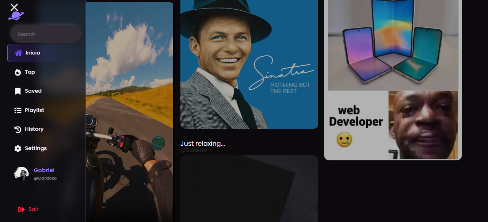

---

<h1 align="center">Artuniverse - Rede Social</h1>

---

<h2 align="center">📖Sobre</h2>

Rede social completa desenvolvida do zero, com um conjunto robusto de funcionalidades que oferecem uma experiência moderna e interativa. O projeto conta com autenticação de usuários, sistema de postagens com suporte a fotos, vídeos e músicas, além da possibilidade de criar playlists personalizadas de mídia. Os usuários podem curtir, comentar, seguir perfis, salvar imagens e até baixar os arquivos compartilhados nas publicações.
    
A plataforma possui um feed dinâmico e um sistema de busca inteligente, capaz de encontrar resultados relevantes mesmo com erros ortográficos. Conta também com visualização detalhada de postagens e perfis, e um sistema de recuperação de senha seguro por link enviado via e-mail.
A interface inicial é totalmente responsiva, adaptando-se a diferentes tamanhos de tela e dimensões de mídia, garantindo uma navegação fluida e consistente. O projeto foi desenvolvido com foco em desempenho, segurança e organização do código, representando uma solução completa e escalável para o conceito de rede social moderna.

---

<h2 align="center">✔O site contém:</h2>

✅ Autenticação de usuários 
✅ Postagem de fotos, vídeos e músicas 
✅ Criação de playlists de mídia 
✅ Curtidas e comentários 
✅ Sistema de seguidores 
✅ Feed dinâmico 
✅ Busca com correção ortográfica 
✅ Salvamento e download de arquivos 
✅ Recuperação de senha por e-mail 
✅ Visualização de postagens e perfis 
✅ Interface inicial responsiva 

### etc...

---

<h2 align="center">🖥Preview</h2>

</img>
 
 
</img>
 
 

---

<h2 align="center">🛠 Tecnologias</h2>

- [MySQL](https://www.mysql.com/)
- [PHP](https://www.php.net/)
- [Python](https://www.python.org/)
- [HTML](https://developer.mozilla.org/pt-BR/docs/Web/HTML)
- [CSS](https://developer.mozilla.org/pt-BR/docs/Web/CSS)
- [JavaScript](https://www.javascript.com/)
- [Tailwind CSS](https://tailwindcss.com/)

---

<h2 align="center">📝Licença</h2>

   Este repositório está sob licença MIT. Você pode ver o arquivo <a href="https://github.com/gabriell-c/artuniverse/blob/main/LICENSE"> LICENSE</a> para mais detalhes. 😉

